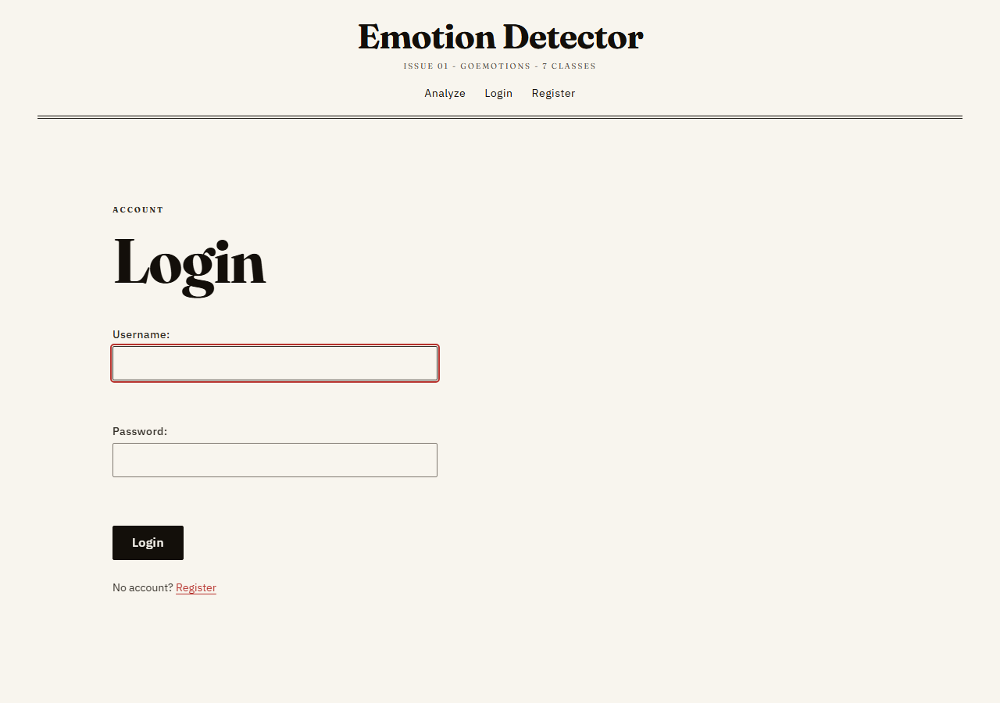
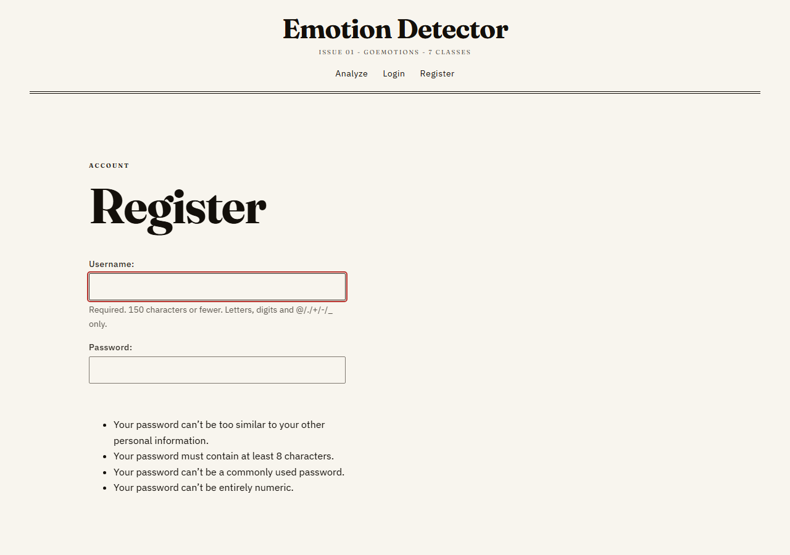
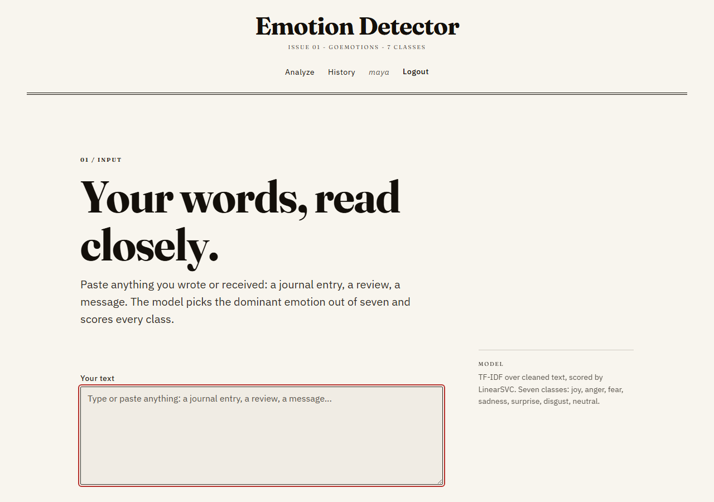
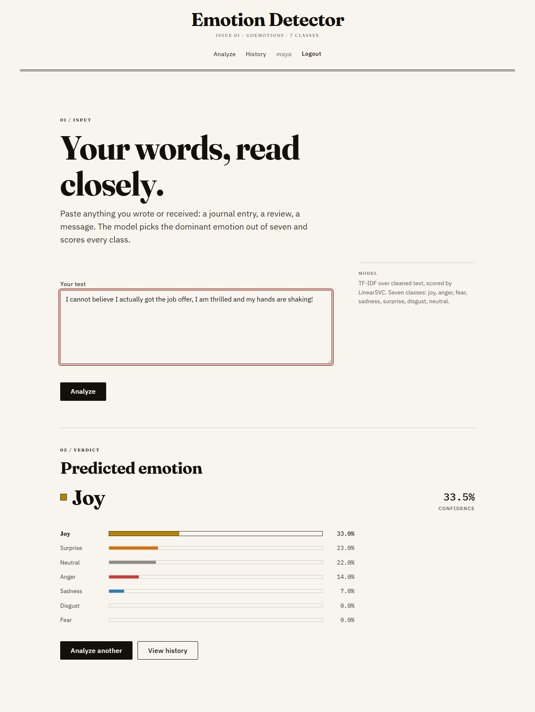
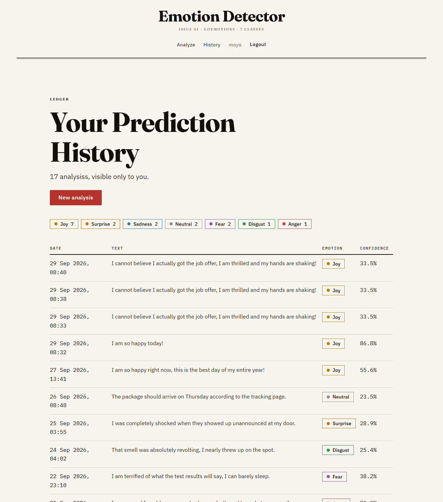
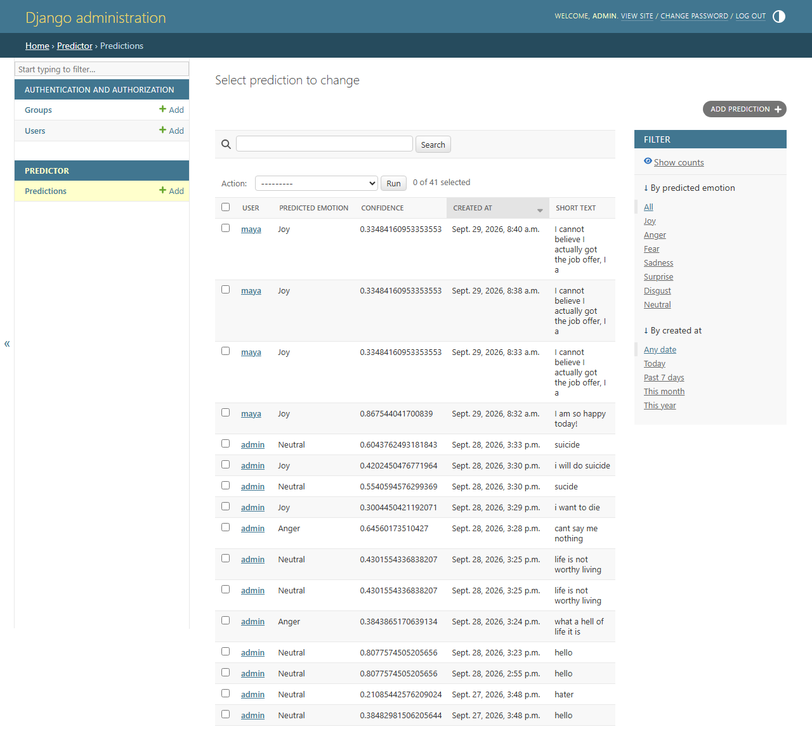

# Emotion Detection Web Application

A full-stack Django application that classifies free-form text into one of **seven emotions** (joy, anger, fear, sadness, surprise, disgust, neutral) using a scikit-learn text classifier, and keeps a private, per-user history of every prediction with confidence scores for all seven classes.

It solves a concrete problem: simple sentiment analysis only says *positive/negative*, which is too coarse for moderation, support-ticket triage, journaling tools or feedback analytics. This app goes one level deeper — and handles the safety-critical case where the raw model would otherwise answer self-harm language with "joy".

**Headline results:** test macro-F1 **0.5911**, accuracy **65.28%**, vs a **0.0767** most-frequent baseline (7.7× better).

---

## Table of Contents

1. [Project Overview](#1-project-overview)
2. [Features](#2-features)
3. [Tech Stack](#3-tech-stack)
4. [Architecture](#4-architecture)
5. [Project Structure](#5-project-structure)
6. [Installation & Setup](#6-installation--setup)
7. [Usage](#7-usage)
8. [Screenshots / Demo](#8-screenshots--demo)
9. [API Documentation](#9-api-documentation)
10. [Engineering Decisions](#10-engineering-decisions)
11. [Testing](#11-testing)
12. [Limitations & Future Improvements](#12-limitations--future-improvements)

---

## 1. Project Overview

Users paste any text — a journal entry, a review, a message — and the app returns the dominant emotion plus a confidence bar for **every** class, not just the winner. Each analysis is stored against the signed-in account and appears in a private history page with an emotion-wise summary.

On the ML side, a TF-IDF + LinearSVC pipeline is trained on the [GoEmotions](https://github.com/google-research/google-research/tree/master/goemotions) dataset (~58k Reddit comments, 28 labels collapsed to 7), tuned entirely on a dev set, and evaluated on the test set exactly once. A rules-based **crisis backoff** guarantees self-harm phrasing is always served as `sadness` rather than the model's unsafe raw answer.

---

## 2. Features

- **Register / login / logout** — Django's built-in auth with hashed passwords, session cookies, and `@login_required` protection on every private page.
- **Emotion classification** — type up to 2,000 characters, get the predicted emotion, its confidence percentage, and 7 ranked confidence bars.
- **Crisis safety backoff** — 18 self-harm phrases force `sadness` above the model's argmax (with a small margin so the bars stay honest); metaphors like *"this job is killing me"* do not false-trigger.
- **Prediction history** — every logged-in user sees only their own rows, newest first, with emotion-summary chips (grouped via SQL `GROUP BY`, not Python loops).
- **Demo database** — `seed_db` command creates 3 accounts and 25 backdated predictions so the UI looks alive immediately.
- **Django admin** — browse, filter and search every prediction at `/admin/`.
- **Form validation** — 3–2000 chars enforced server-side with friendly error messages.
- **32 automated tests** — auth flows, prediction flow, model loading, crisis logic, and seed idempotency.

---

## 3. Tech Stack

| Technology | Role in this project |
|---|---|
| **Python 3.14** | Application language; shared between the web app and the ML package. |
| **Django 6** | Web framework: ORM, URL routing, templates, forms, sessions, CSRF protection and the auth system — all used, none reinvented. |
| **scikit-learn 1.9** | `TfidfVectorizer` (word 1–3 grams + char 2–6 grams), `LinearSVC` classifier, `CalibratedClassifierCV` for probabilities. |
| **pandas / numpy** | TSV loading, label collapsing, and the vector math behind softmax / probability boosting. |
| **NLTK** | English stopword list (optional cleaning stage; currently disabled by default because it hurt dev scores). |
| **SQLite** | Zero-config database shipped as `django_app/db.sqlite3`, pre-seeded with demo data. |
| **pickle** | Serializes the fitted vectorizer + model so Django can load them at runtime without retraining. |
| **Jupyter / matplotlib / seaborn** | `ml/pipeline.ipynb` for the documented EDA → training → evaluation workflow; headless chart generation in `ml/eda.py` and `ml/evaluate.py`. |
| **HTML / CSS** | Server-rendered templates with a custom editorial design system (`static/css/tokens.css` + `style.css`). No JS framework. |

---

## 4. Architecture

Two components connected by **artifact files** — the ML side trains once and exports pickles; the web side only ever loads them.

```
┌─────────────────────────────  TRAINING (offline, run by you)  ─────────────────────────────┐
│  ml/data/{train,dev,test}.tsv                                                             │
│        │                                                                                  │
│        ▼                                                                                  │
│  ml/preprocess.py  ── clean_text() ── 28→7 label collapse ── TF-IDF fit (train only)       │
│        │                                                                                  │
│        ▼                                                                                  │
│  ml/train.py / ml/pipeline.ipynb  ── LinearSVC sweep (C, class weights)                   │
│                                ── calibration ── per-class boosts ── final test eval      │
│        │                                                                                  │
│        ▼                                                                                  │
│  ml/model/vectorizer.pkl (110k features)   ml/model/model.pkl (BoostedClassifier)         │
└──────────────────────────────────────────────┬─────────────────────────────────────────────┘
                                               │  pickle.load()  (once per process, lru_cache)
┌──────────────────────────────────────────────▼─────────────────────────────────────────────┐
│                                  SERVING (Django)                                          │
│                                                                                           │
│  Browser ──HTTP──► config/urls.py ──► app urls.py ──► views.py                            │
│                                                                    │                      │
│                        ┌───────────────────────────────────────────┤                      │
│                        ▼                                           ▼                      │
│              predictor/utils.py                          predictor/models.py              │
│              predict_emotion():                          Prediction.objects.create()       │
│                1 clean_text(text)                                   │                     │
│                2 vectorizer.transform()                             ▼                     │
│                3 decision_function → softmax                ┌──────────────┐              │
│                4 apply_crisis_backoff() (ml/crisis.py)      │  SQLite      │              │
│                5 rank → predicted + 7 scores                │  db.sqlite3  │              │
│                        │                                    └──────────────┘              │
│                        ▼                                                                   │
│              template (predict.html) ──► confidence bars ──► Browser                       │
└───────────────────────────────────────────────────────────────────────────────────────────┘
```

**Data flow for one prediction:** form POST → validate → `clean_text` → TF-IDF transform (1×110,000 sparse) → SVM decision scores → softmax → crisis backoff → ranked scores → DB row → rendered bars.

---

## 5. Project Structure

```
django-project/
├── requirements.txt              # pinned dependencies
├── screenshots/             # README images
│
├── django_app/                   # ── DJANGO PROJECT ──
│   ├── manage.py                 # CLI: runserver, migrate, test, seed_db
│   ├── db.sqlite3                # database (ships with demo data)
│   ├── config/                   # project-level settings
│   │   ├── settings.py           #   installed apps, DB path, static files, LOGIN_URL
│   │   ├── urls.py               #   root router: /admin/, /accounts/, /
│   │   └── wsgi.py / asgi.py     #   server entry points
│   ├── accounts/                 # ── APP 1: authentication ──
│   │   ├── views.py              #   register / login / logout + safe ?next= redirects
│   │   ├── urls.py               #   /accounts/{register,login,logout}/
│   │   ├── tests.py              #   14 tests
│   │   └── templates/accounts/   #   login.html, register.html
│   ├── predictor/                # ── APP 2: the product ──
│   │   ├── models.py             #   Prediction model → table predictor_prediction
│   │   ├── views.py              #   predict_view, history_view
│   │   ├── urls.py               #   / and /history/
│   │   ├── forms.py              #   EmotionForm (3–2000 chars)
│   │   ├── utils.py              # ★ ML serving: pickle load + predict_emotion()
│   │   ├── admin.py              #   Prediction registered in admin
│   │   ├── tests.py              #   18 tests
│   │   ├── migrations/           #   schema versions (0001_initial)
│   │   ├── management/commands/seed_db.py   # demo accounts + 25 predictions
│   │   └── templates/predictor/  #   predict.html, history.html
│   ├── templates/base.html       # shared skeleton (nav, footer, messages)
│   └── static/                   # css/style.css, css/tokens.css, favicon.svg
│
└── ml/                           # ── MACHINE LEARNING PACKAGE ──
    ├── data/                     # train.tsv (43,410) · dev.tsv (5,426) · test.tsv (5,427)
    │                             # crisis_eval.tsv (38-row safety slice)
    ├── preprocess.py             # clean_text, 28→7 mapping, TF-IDF builder, model wrappers
    ├── train.py                  # training + tuning script → writes the .pkl artifacts
    ├── crisis.py                 # 18 crisis phrases + apply_crisis_backoff()
    ├── pipeline.ipynb            # documented EDA → training → evaluation notebook
    ├── eda.py / evaluate.py      # headless chart generation
    ├── eval_crisis.py            # proves the crisis backoff works
    └── model/                    # model.pkl · vectorizer.pkl · training_scope.txt
```

★ = the bridge between the two worlds.

---

## 6. Installation & Setup

**Prerequisites:** Python 3.14 (3.11+ should work), pip. No environment variables, external services or API keys required.

```bash
# 1. clone and enter the project
git clone <repo-url>
cd django-project

# 2. virtual environment
python -m venv .venv
.venv\Scripts\activate          # Windows
# source .venv/bin/activate     # macOS/Linux

# 3. dependencies
pip install -r requirements.txt

# 4. database — tables + demo data (db.sqlite3 also ships pre-seeded)
python django_app/manage.py migrate
python django_app/manage.py seed_db      # optional: 3 accounts + 25 predictions

# 5. run
python django_app/manage.py runserver
# → http://127.0.0.1:8000/
```

**Notes**

- **Model artifacts** (`ml/model/*.pkl`) are committed, so no training step is needed to run the site. To retrain: `python ml/train.py` (optional `--dev-only` to tune without touching the test set, `--refit` to train the winner on train+dev).
- **NLTK stopwords** download automatically on first use (`ml/preprocess.py:46`).
- **Configuration** lives in `django_app/config/settings.py` (SQLite path, static files, `LOGIN_URL`). Defaults are dev-oriented (`DEBUG = True`) — see §10 before deploying.
- **Demo credentials**

  | Account | Password | Role |
  |---|---|---|
  | `admin` | `Admin@12345` | superuser (Django admin) |
  | `maya` | `Demo@12345` | demo user |
  | `ravi` | `Demo@12345` | demo user |

---

## 7. Usage

1. **Register** at `/accounts/register/` (or log in as `maya / Demo@12345`).
   Visiting any protected page while logged out redirects you to login and returns you afterwards via `?next=`.
2. **Analyze text** on the home page — paste anything, hit **Analyze**.
   You get the predicted emotion, its confidence, and 7 ranked bars; the result is saved to your history automatically.
3. **Try the safety feature** — submit `"i want to die"` → forced **Sadness**; then `"this job is killing me"` → normal classification (no false trigger).
4. **View history** at `/history/` — your rows only, summary chips, newest first.
5. **Switch accounts** (log out → log in as `ravi`) to see that histories are fully isolated per user.
6. **Admin** at `/admin/` as `admin` — filter predictions by emotion, search by text or username.

---

## 8. Screenshots / Demo

| | |
|---|---|
| **Login** | **Register** |
|  |  |
| **Predict form** | **Result with confidence bars** |
|  |  |
| **History (per-user)** | **Django admin** |
|  |  |

---

## 9. API Documentation

The app is **server-rendered** (HTML responses, no JSON API). Endpoints below — all state-changing routes require CSRF token and, where marked, an authenticated session.

| Method | URL | View | Auth | Description |
|---|---|---|---|---|
| `GET` | `/` | `predict_view` | required | Renders the prediction form (`EmotionForm`). |
| `POST` | `/` | `predict_view` | required | **Body:** `text` (3–2000 chars), `csrfmiddlewaretoken`. **200:** HTML with result + 7 scores. **Invalid:** 200 with field errors, nothing saved. |
| `GET` | `/history/` | `history_view` | required | Renders the caller's predictions + summary chips. |
| `GET` | `/accounts/register/` | `register_view` | anonymous | Renders signup form. |
| `POST` | `/accounts/register/` | `register_view` | anonymous | **Body:** `username`, `password1`, `password2`. Creates user, logs in, `302 → /`. |
| `GET` | `/accounts/login/` | `login_view` | anonymous | Renders login form; honours safe `?next=`. |
| `POST` | `/accounts/login/` | `login_view` | anonymous | **Body:** `username`, `password`. Sets session cookie, `302 → next or /`. |
| `POST` | `/accounts/logout/` | `logout_view` | required | Destroys session, `302 → /accounts/login/`. `GET` returns **405**. |
| `GET` | `/admin/…` | Django admin | superuser | CRUD for `Prediction`, filtered by emotion/date, searchable by text/user. |

**Example `POST /` result block (as HTML, conceptually):**

```json
{
  "predicted": "joy",
  "confidence": 0.843,
  "crisis_phrase": null,
  "scores": {
    "joy": 0.843, "neutral": 0.071, "surprise": 0.032,
    "fear": 0.018, "sadness": 0.014, "disgust": 0.011, "anger": 0.011
  }
}
```

**Behavioural contracts**

- Unauthenticated `GET`/`POST` on `/` or `/history/` → `302` to `/accounts/login/?next=…`.
- Redirect targets from `?next=` are validated with `url_has_allowed_host_and_scheme` (open-redirect protection).
- Missing model artifacts → `ArtifactMissing` caught in the view, surfaced as a flash message (no crash, nothing saved).

---

## 10. Engineering Decisions

**Artifacts over in-process training.** The model is trained offline and shipped as `vectorizer.pkl` + `model.pkl`. Django never imports pandas or fits anything at runtime — startup stays fast and the serving path can't accidentally retrain. The pickles are loaded **once per process** via `@lru_cache(maxsize=1)` (`predictor/utils.py:23`), not on every request.

**Shared preprocessing module.** `clean_text()` lives in `ml/preprocess.py` and is imported by *both* training and serving. This eliminates training/serving skew — the #1 silent bug in ML services — at the cost of Django knowing about the `ml/` package (handled with a small `sys.path` insert and a `MODEL_DIR` fallback in `settings.py:78`).

**Rules layer on top of the model for safety.** The raw classifier answered self-harm text with *joy* because GoEmotions contains almost none of that language. Options were: fine-tune on external crisis data (no time/label budget), or add a narrow, auditable override. I chose the backoff: 18 phrases, forced `sadness` by a **0.10 margin** (so bars stay visibly uncertain instead of faking confidence), then renormalized. It is evaluated on a dedicated 38-row slice (24 crisis / 14 contrast) and unit-tested. Trade-off acknowledged: it's a patch for a data gap, not a model fix (§12).

**Macro-F1 as the primary metric.** The classes are heavily imbalanced (test: 1,603 joy vs 76 disgust). Accuracy would let a lazy model look good (~35% by always guessing joy); macro-F1 weights all 7 classes equally. The most-frequent baseline (0.0767) is always reported so the number has meaning.

**Strict train/dev/test discipline.** The vectorizer is fit on **train only**; every choice (C grid, class weights, calibration method, boost values) is made on **dev**; the **test** set is touched exactly once, at the end. This keeps 0.5911 honest instead of inflated.

**Probability handling.** LinearSVC gives unbounded decision scores, so serving applies softmax (max-shifted for numerical stability) — except the shipped model is already calibrated, in which case `predict_proba` is used directly. Per-class boosts are applied inside a `BoostedClassifier` wrapper so the displayed bars and the chosen label always agree.

**Django's built-in auth, not custom.** `UserCreationForm`, `AuthenticationForm`, PBKDF2 hashing and sessions come from the framework. Custom auth is a common source of vulnerabilities; there's nothing project-specific about registering a user.

**Two apps, not one.** `accounts` (generic) and `predictor` (domain) are separate so concerns, tests and URLs don't tangle — the same reason for `config` being settings-only.

**JSONField for the score snapshot.** `all_scores` stores all 7 probabilities at prediction time, so history shows *what the model said then*, unaffected by later retrains.

**SQLite.** Right choice here: zero setup, file-based, ships with the repo including seed data. Not right for concurrent write loads (§12).

---

## 11. Testing

**32 tests, all passing** (~35 s) across two suites:

| Suite | Tests | Covers |
|---|---|---|
| `accounts/tests.py` | 14 | register (create, duplicate, mismatch, logged-in redirect), login (success, bad password, safe/unsafe `?next=`, logged-in redirect), logout (POST works, GET → 405), anonymous redirects for `/` and `/history/`. |
| `predictor/tests.py` | 18 | artifacts load with exactly 7 classes, ranked scores sum to 1.0, stopword-only input, **crisis backoff** (6 forced-sadness cases, metaphor non-trigger, 38-row slice end-to-end), predict view (renders, saves row, rejects short text, requires login), history (own rows only, summary counts, empty state, login required), `seed_db` (accounts created, 25 rows, backdating, idempotency). |

```bash
# run the full suite (from inside django_app/ — see note)
cd django_app
python manage.py test

# a single app or class
python manage.py test accounts
python manage.py test predictor.tests.CrisisBackoffTests
```

> **Note:** `manage.py test` discovers tests relative to the working directory — run it from `django_app\`, otherwise you get `Found 0 test(s)`.

Additional checks worth running:

```bash
python django_app/manage.py check               # System check: no issues
python django_app/manage.py makemigrations --check --dry-run   # No changes detected
python ml/eval_crisis.py                        # crisis slice report
```

---

## 12. Limitations & Future Improvements

**Limitations (honest list)**

- **Crisis handling is rules, not learning.** The backoff covers 18 known phrases; novel phrasing or other languages fall through to the raw model. The data gap it patches still exists.
- **Joy ↔ neutral confusion dominates errors** (270 + 206 test mistakes) — a genuine ambiguity, not just a model flaw. Recall on anger (0.46) and disgust (0.38) is weak for the same imbalance reason.
- **Single-label training data only.** 16% of GoEmotions rows (multi-emotion) are dropped — real text is often mixed-emotion, which the app can't express.
- **English-only**, with no negation handling beyond what char n-grams happen to learn.
- **No rate limiting or async inference** — every POST runs inference synchronously in the request (fast at this size, but it wouldn't scale under load).
- **SQLite** limits concurrent writers; fine for a demo, wrong for production traffic.
- **Dev-oriented settings:** `DEBUG = True`, hard-coded `SECRET_KEY`, `ALLOWED_HOSTS = ["*"]`.
- **Macro-F1 0.5911 sits just under the 0.60 target.**

**Next steps**

1. **Real crisis data** — fine-tune (or at least evaluate) on a labelled self-harm dataset so safety comes from the model, retiring the rules layer.
2. **Stronger model** — DistilBERT/zero-shot baseline to see if the joy/neutral boundary improves; or keep linear and add negation features + multi-label learning (sigmoid targets) to use those dropped 16%.
3. **Probability calibration review** — currently sigmoid; isotonic or temperature scaling on a larger dev slice.
4. **Production hardening** — `.env`-driven `SECRET_KEY`/`DEBUG`, `ALLOWED_HOSTS` whitelist, HTTPS/secure cookies, rate limiting, and a JSON endpoint if API consumers appear.
5. **Observability** — log prediction latency + crisis-trigger counts to detect drift between model and rules.
6. **CI** — GitHub Actions running `manage.py test` and `makemigrations --check` on push.

---

